```{r setup, include=FALSE}
knitr::opts_chunk$set(echo = TRUE, message= FALSE)
library(knitr)
library(tidyverse)
```

## **Introduction**

The CA State Waterboards contracted with the San Francisco Estuary Institute (SFEI) to use satellite imagery to estimate  cyanobacterial abundance. Algorithms to estimate cyanobacterial abundance in the surface waters of Lake Erie have been developed by Wynne et al. (2008) and Lunetta et al. (2015). Working with NOAA staff, SFEI applied these algorithms to waterbodies in California. 

To better understand the performance of the satellite tool, field verification sampling was conducted in 2019. This document presents the initial results from the 2019 field verification effort.

## **Methods**

#### *Field sampling*

Seven sampling events occurred at four different waterbodies from August 1 to October 8, 2019 (Table 1). Only Clear Lake had satellite pixels with positive CI~cyano~ values on the sampling days. There had been blooms at San Pablo Reservoir and Lake San Antonio, but they had dissipated to non-detects on the satellite by the time we were able to sample them. Lake Almanor was chosen due to its higher elevation and previous questionable CI~cyano~ values generated by MERIS imagery. 

```{R echo= FALSE, results= 'asis'}
lakes <- data.frame(Name= c("Clear Lake", "Lake Almanor", "Lake San Antonio", "San Pablo Reservoir"),
                    County= c("Lake", "Plumas", "Monterrey", "Contra Costa"),
                    `Sampling date`= c("Aug-7, Aug-16, Oct-8", "Aug-15", "Aug-1", "Aug-12"),
                    Area_km2= c("180", "113","23", "60"),
                    elevation_m= c("432", "1373","245", "96")
                    )
names(lakes)[3:5] <- c("Sampling date", "Surface area (km^2^)", "Elevation (m)")

kable(lakes, caption= "**Table 1.** Waterbody information")
```

Field sampling occurred on the same day as the Sentinel-3a flyover. In a waterbody three pixels were selected for sampling. Within a pixel, three samples were collected, for a total of nine measurement sites (Fig. 1). At each sampling point, a Malvern Panalytical Fieldspec Handheld2 Pro radiometer was used to collect radiance data, which can be converted to a CI~cyano~ equivalent value for comparison to the satellite data. Each reading involved collecting ten measurements at 1 nm wavelength resolution from 300-900 nms, which were then averaged into a single value per nm for the reading. Readings were taken on a calibrated 10% Spectralon reflectance plate, the water, and the sky. All readings were taken 40-45 degrees altitude and 115-135  degrees alzimuth from the sun. Triplicate plate, water, and sky readings were collected at each sampling site.  Additionally, Secchi depth was measured, and depth integrated grab samples (1 m) for chlorophyll-a were collected at each sampling site. Chlorophyll-a samples were immediately chilled on ice in a cooler and filtered onto 0.7 micrometer (Whatman GF/C) filters back on shore. The filters were then wrapped in aluminum foil and frozen until fluorometric analysis.


```{r, echo= FALSE, out.width= "30%"}
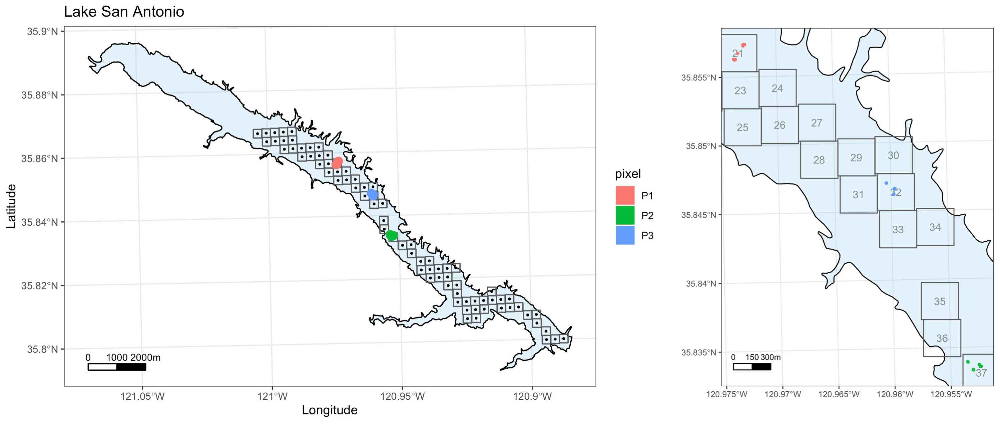
#include_graphics("../Data/20190801_LakeSanAntonio/lsa_lake_map.jpg")
#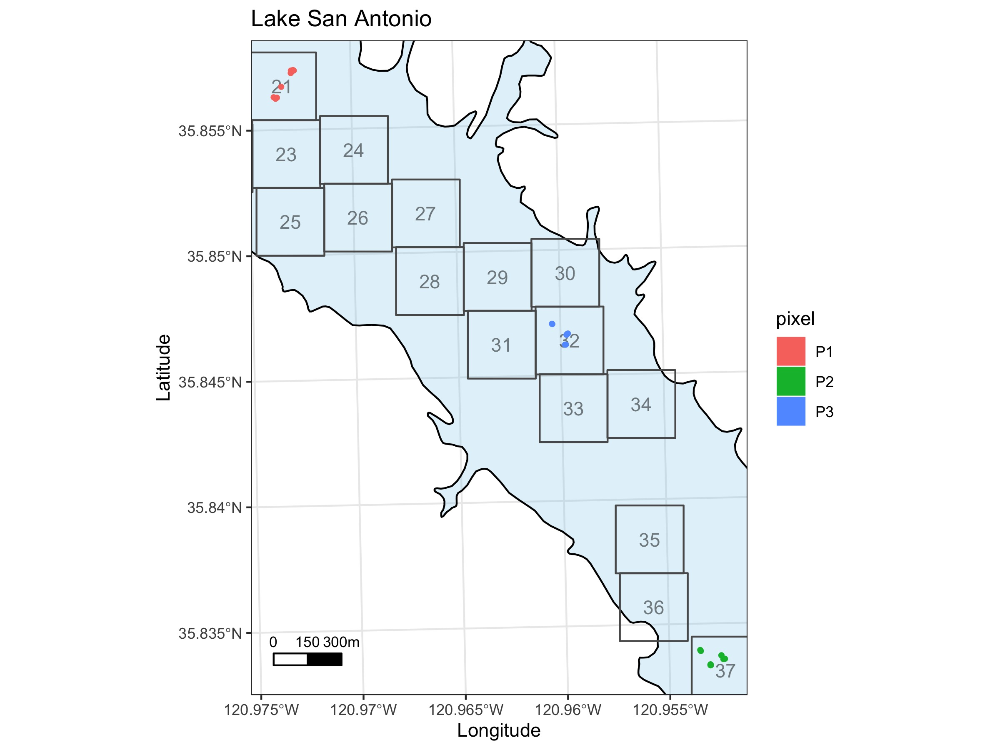
```
  
  **Figure 1.** Sampling maps of Lake San Antonio. Left panel) Entire lake showing the pixel locations for satellite imagery. Colors show the locations of the sampling pixels. Right panel) Zoom in of the sampling area showing the three different sampling sites within the three sampling pixels 21, 32, and 37. Numbers are the pixel ID for the satellite.  
  
#### *Field remote sensed reflectance calculations* 
The raw radiance values (W/m^2^/nm/sr) from the radiometer were converted to remote sensed reflectance (R~rs~) values per nm/sr using the program `test_asd_group.exe` provided to the Waterboards by NOAA staff. The calculations take the plate, water, and sky readings and calculate R~rs~ based on equation 4 in Mobley 1999:
$$
\begin{equation}
R_{rs} = \frac{L_{water} - \rho \times L_{sky}}{\pi/0.1 \times L_{plate}}
\end{equation}
$$ {#eq:1}
Where L indicates the radiance values, and $\rho$ represents the proportion of sky radiance that is reflected by the water's surface and is set to 0.028 (Mobley 1999). The plate value is multiplied by $\pi$ to integrate over the hemisphere and convert from radiance units of W/m2/sr to W/m2.

The R~rs~ values are then corrected following the procedure in Gould et al. (2001) to remove reflected sunglint and and sky light fr This involves 
$$
\begin{equation}
Corrected~R_{rs} = R_{rs} - \frac{RrsSky_{708-712} - \frac{aw_{740}}{aw_{710}} \times RrsSky_{738-740}}{1 - \frac{aw_{740}}{aw_{710}}}
\end{equation}
$$ {#eq:2}
Where the water absorbtion coefficients aw~710~ and aw~740~ are constants of 0.832 and 2.758 at 710 and 740 nm, respectively. 

#### *Cyanobacterial index calculations*

The R~rs~ values were  used to calculate the cyanobacterial indices CI and CI~cyano~. The CI value is derived from the spectral shape (SS) at 681 nm and is calculated with equation 1 in Wynne et al. 2008: 
$$
\begin{equation}
SS(681) = rrs681 - rrs665 - (rrs709 - rrs665) \times \frac{681-665}{709-665}
\end{equation}
$$ {#eq:3}
More negative SS(681) values represent higher cyanobacterial abundances in the surface waters of a pixel. To transform it into positive values the SS(681) is converted to CI by: 
$$
\begin{equation}
CI = -1*SS(681)
\end{equation}
$$ {#eq:4}
CI values <0 indicate no cyanobacteria present. However, certain water conditions can generate positive CI values, even when there are no cyanobacteria present. To reduce the frequency of false positives, the spectral shape at 665 nm is used as an additional measurement to determine if cyanobacteria are present (Matthews et al. 2012 and Lunetta et al 2015): 
$$
\begin{equation}
SS(665) = rrs665 - rrs620 + (rrs620 - rrs681) \times \frac{665-620}{681-620}
\end{equation}
$$ {#eq:5}
When SS(665) is >0 it indicates cyanobacteria present in the water and when it is <0 cyanobacteria are predicted to be absent. SS(665) is used as an exclusion criteria to create a new indice CI~cyano~. The value of CI~cyano~ is a function of CI (eq. 3) and SS(665): 
$$
\begin{equation}
  CI_{cyano}=\begin{cases}
    CI, & \text{if SS(665) > 0}.\\  
    0, & \text{if SS(665) < 0}.
  \end{cases}
\end{equation}
$$ {#eq:6}

If SS(665) is > 0, then cyanobacteria are assumed to be present and the value of CI~cyano~ is the same as the CI value calculated with eq. 3. When SS(665) <0 (i.e. no cyanobacteria) the value of CI~cyano~ is 0, even if they have a positive CI values with eq. 3.

#### *Satellite data calculations*
The satellite CI~cyano~ value is calculated from the OLCI sensor on Sentinel-3a satellite. The value is calculated by NOAA using top-of-atmosphere reflectance values applied to equations 1-5 above (Wynne et al. 2018). NOAA delivers the CI~cyano~ product for each pixel as an integer ranging in values 0-250, corresponding to increasing CI~cyano~ value. The pixel integer value is converted to CI~cyano~ with: 
$$
\begin{equation}
CI_{cyano} = 10^{0.012 \times PixInteger - 4.2}
\end{equation}
$$ {#eq:7}


CI~cyano~ has a range of 0.000063 - 0.063270. To make these values easier to work with, SFEI and the CA Waterboards then multiply CI~cyano~ by a constant to make the values easier to work with by putting them on a scale of 1-1000. This index is called CI~mod~ and calculated by: 
$$
\begin{equation}
CI_{mod} = CI_{cyano} * 15805.18
\end{equation}
$$ {#eq:8}

## **Results**

#### *Lake conditions*
Lakes ranged in phytoplankton concentrations, with median chl-a concentrations ranging from 1-40 ug/L (Fig. 2) and Secchi depths ranged from <1 - 4.5 meters (Fig. 3). Only in Clear Lake were cyanobacterial colonies visible (Fig. 4), however, microscopic analysis of samples did identify cyanobacterial taxa in some waterbodies, including *Dolichospermum*, *Microcystis*, and *Gloeotrichia* (Table 2). No cell counts of cyanobacteria abundance were performed.

```{r, echo=FALSE, fig.cap="", out.width = '60%', fig.align= "center"}
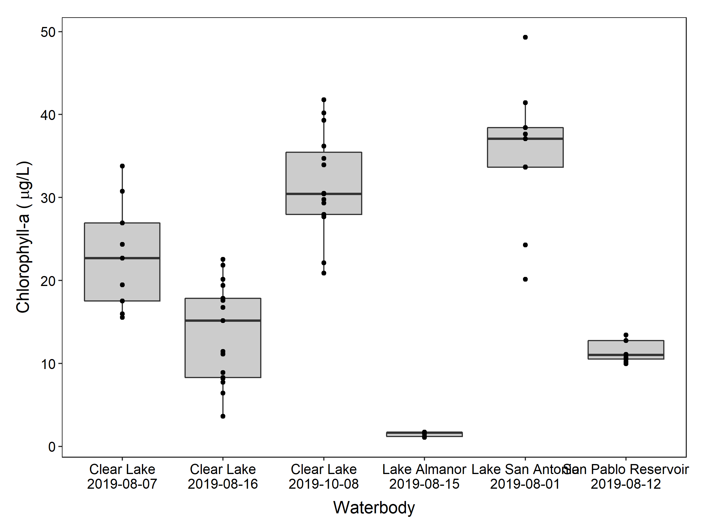

```
  
**Figure 2.** Chlorophyll-a concentrations at sampling locations in waterbodies. (Note: data was not collected  for Clear Lake on Aug-16 and Oct-8).  

```{r, echo=FALSE,  fig.cap="", out.width = '60%', fig.align= "center"}
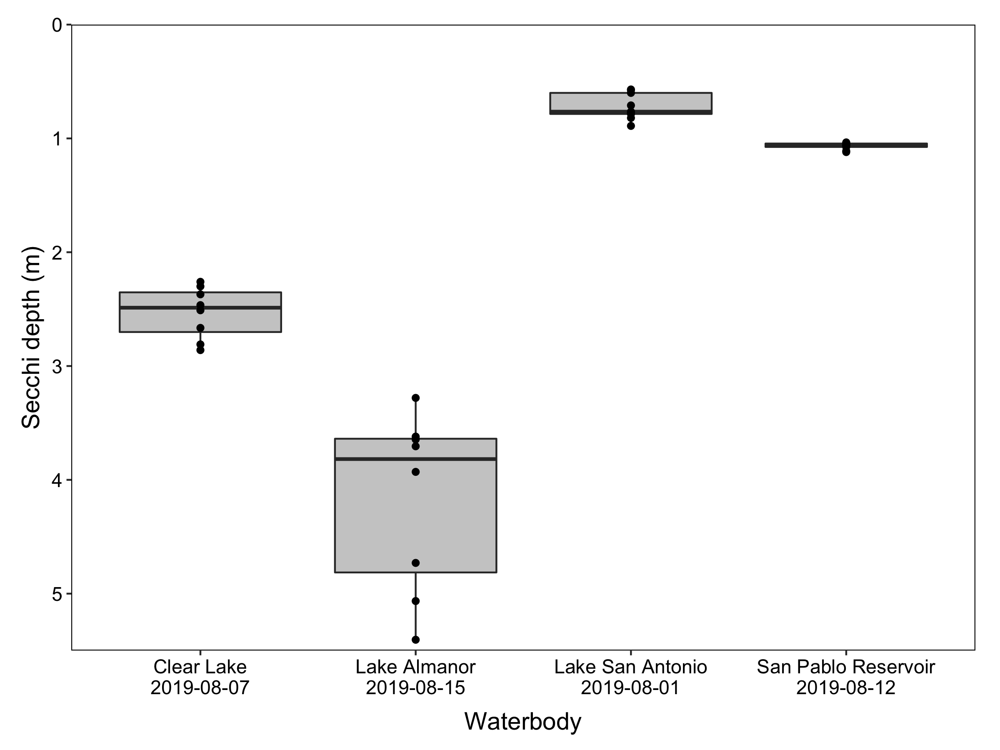
```
  
**Figure 3.** Secchi depth at sampling locations in waterbodies. (Note: data was not collected for Clear Lake on Aug-16 and Oct-8).  


```{R echo= FALSE, results= 'asis'}

cyano_taxa <- data.frame(Name= c("Clear Lake", "Clear Lake", "Clear Lake", "Lake Almanor", "Lake San Antonio", "San Pablo Reservoir"),
                    Sampling_date= c("Aug-7", "Aug-16", "Oct-8", "Aug-15", "Aug-1", "Aug-12"),
                    Cyanobacteria= c("*Microcystis*, *Gloeotrichia*, *Dolichospermum*", "No data","No data", "None", "*Dolichospermum*", "*Dolichospermum*"))

kable(cyano_taxa, caption= "**Table 2.** Microscopic cyanobacteria identification.")

```

```{r, echo=FALSE, fig.cap=""}

include_graphics("../Data/Figures_output/Field_Photos_Figure.png")
#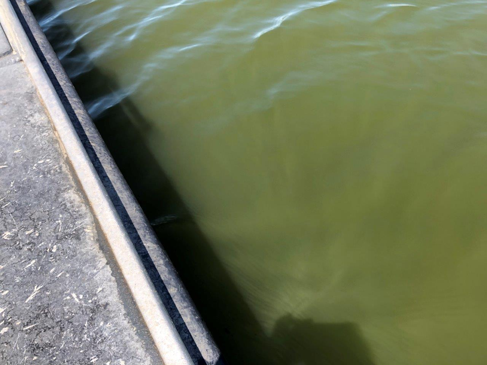
#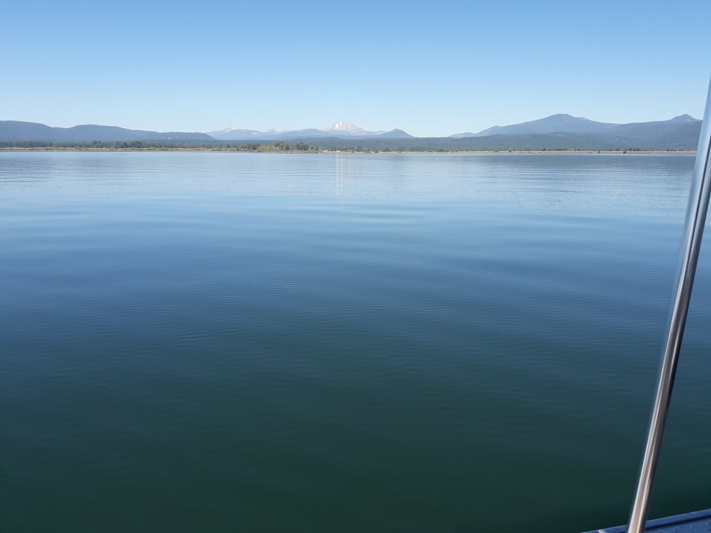

#include_graphics("../Data/20190816_ClearLake/Pictures/IMG_5690.png")
#include_graphics("../Data/20191008_ClearLake/Pictures/pic4.jpg")

```
  
**Figure 4.** Photographs of water conditions on sampling days. **a**) Lake San Antonio, **b**) Lake Almanor, **c**) Clear Lake Aug-16, and **d**) Clear Lake Oct-08.  

#### *Remote sensed reflectance spectra*
  
The field collected remote sensed reflectance (R~rs~) data showed chlorophyll-a absorbption decrease ~681 nm in samples with high chlorophyll-a concentrations, Clear Lake and Lake San Antonio (Fig. 5 top row). Lake Alanor had the lowest chl-a concentratios (Fig. 2) and little chlorophyll a absorption an no phycocyanin absorption. San Pablo Reservoir demonstrated lower chlorophyll absorption. The Lake Almanor and San Pablo Reservoir CI~mod~ values were below satellite detection levels due to an absence of the phycocyanin absorption at 620 nm. 
  
```{r, echo=FALSE, fig.cap="", out.width = '50%', results= "asis"}

include_graphics("../Data/Figures_output/RRS_Spectra_Figure.png")

#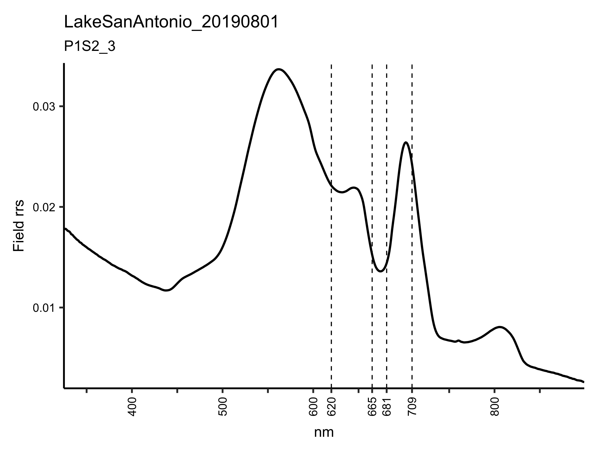
#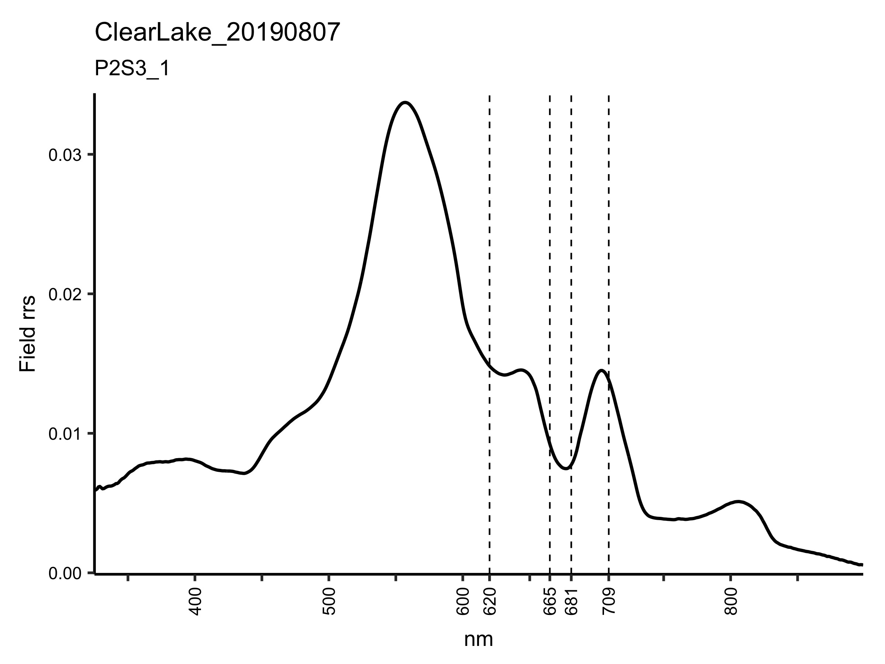
#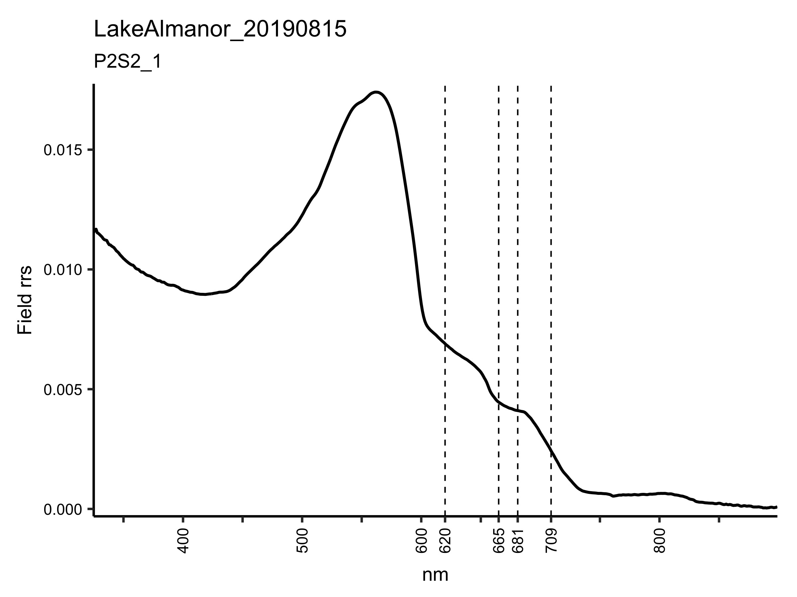
#include_graphics("../Data/spectral_shape_plots/SanPabloReservoir_20190812-P1S3_1-rrs.jpg")


#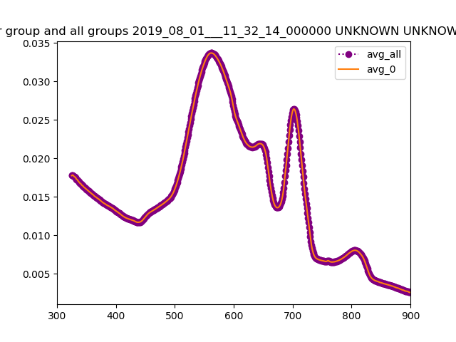
#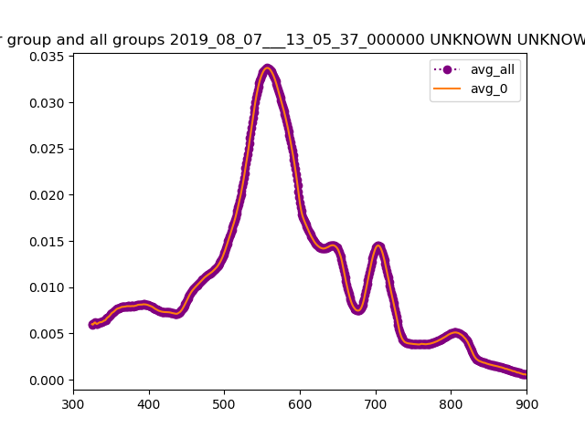
#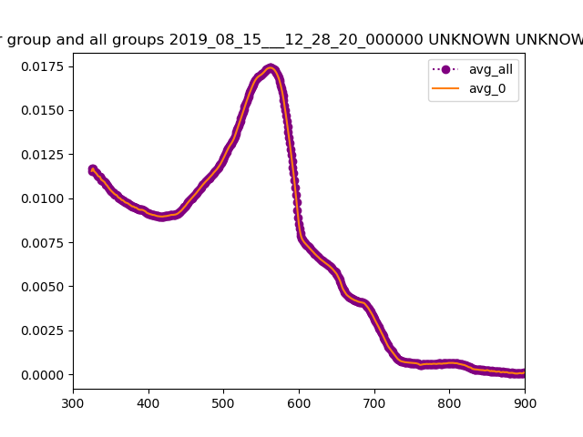
#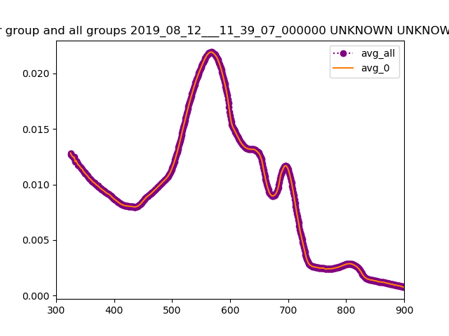
```

**Figure 5.** Field collected remote sensed reflectance (R~rs~) spectra. Waterbody name, date, and pixel are given for each spectra. Vertical dashed lines mark OLCI band center wavelengths at 620, 665, 681, and 709 nanometers (nm). 

#### *SS(665) values*
  

All 142 field SS(665) values were <0 suggesting that cyanobacteria were not present at any of the field sampling locations (Fig. 6). The range of SS(665) values was -0.0025 to -0.000071. 

```{r, echo=FALSE, fig.cap=""}
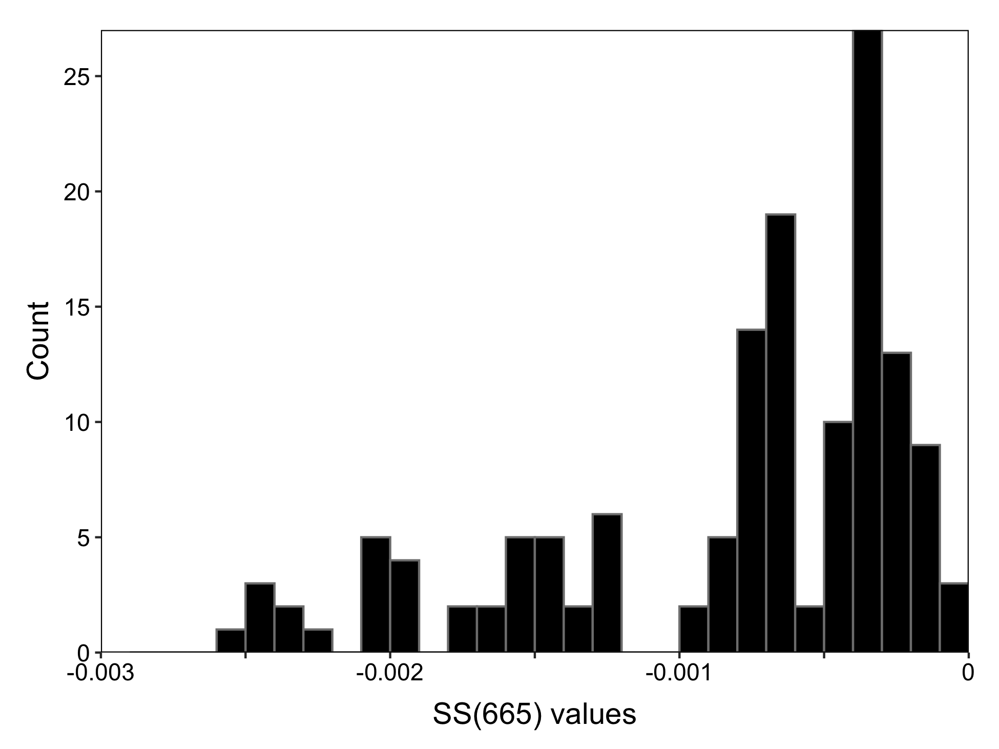
```
  
  **Figure 6.** Histogram of all SS(665) values (N = 142).
  
  
#### *CI values*  
  
CI values will be shown in the results, since CI~cyano~ values would all be zero, because  CI~cyano~ values were all <0. Variance among the triplicate measurements within a site was low (Fig. 7). Lake Almanor and San Pablo reservoir had CI values <0 suggesting no cyanobacteria present in the waterbody. All other waterbodies had positive CI values, possibly suggesting the presence of cyanobacteria, though other water quality conditions can generate positive CI values in the absence of cyanobacteria. 

```{r, echo=FALSE, fig.cap="", fig.align= "center"}
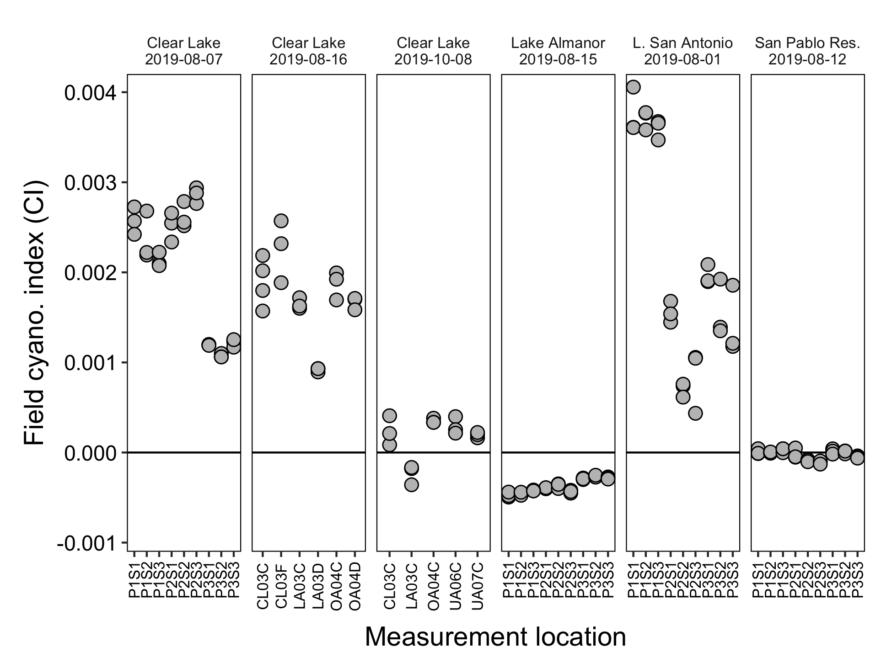
```

  
**Figure 7.** Field collected CI values from all sampling locations.

The field data estimated higher cyanobacterial abundances than the satellite data (Fig. 8). Both the satellite and field data estimated no cyanobacteria at Lake Almanor and San Pablo Reservoir. The field and satellite data were also well correlated in estimating cyanobacterial abundances at Clear Lake on Aug-07 and a single pixel on 16-Aug. However, all field R~rs~ spectra and visual observations from Lake San Antonio, Clear Lake 08-Oct, and two pixels at Clear Lake 16-Aug suggested cyanobacterial abundances, while the satellite estimated no cyanobacteria. If the field derived CI~cyano~ were used, instead of CI, then all field data would have CI~cyano~=0. This would more closely match the satellite data, since the majority of the satellite pixels were non-detects. The field CI values related correlated better with chlorophyll-a levels (Fig. 9), than with the the satellite CI values.


```{r, echo=FALSE, fig.cap="", out.width = '50%'}

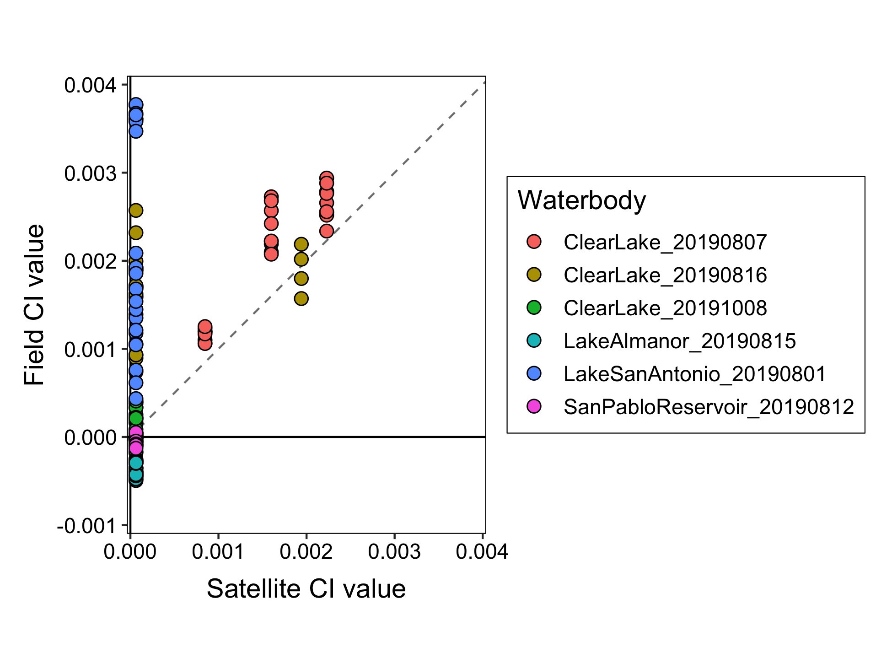
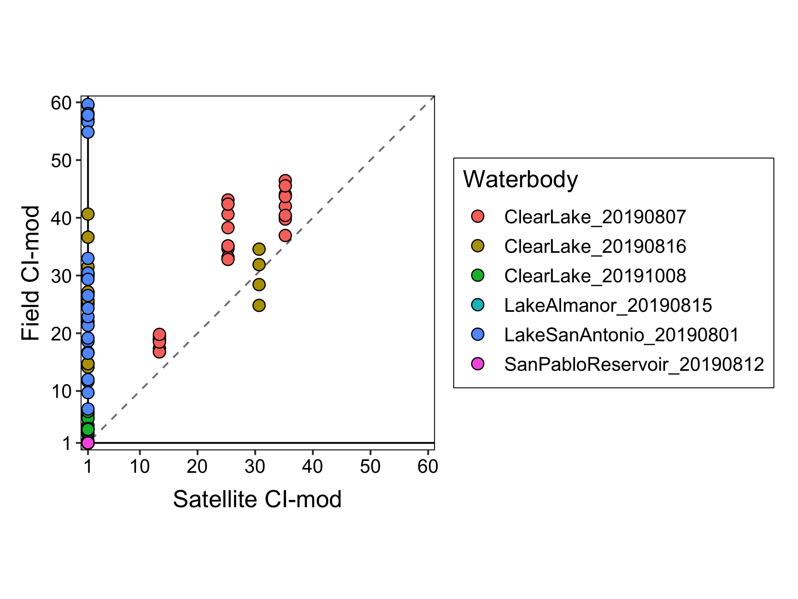

```

   **Figure 8.** Comparison of field and satellite data. Top panel) Field CI~cyano~ values and Satellite CI~cyano~ values. Bottom panel) Field CI~mod~ values and satellite CI~mod~ values (modified scale 1-1000. Colors show the waterbody and sampling date. The 1:1 line is dashed.
   


```{r, echo=FALSE, fig.cap="", out.width = '60%', fig.align= "center"}
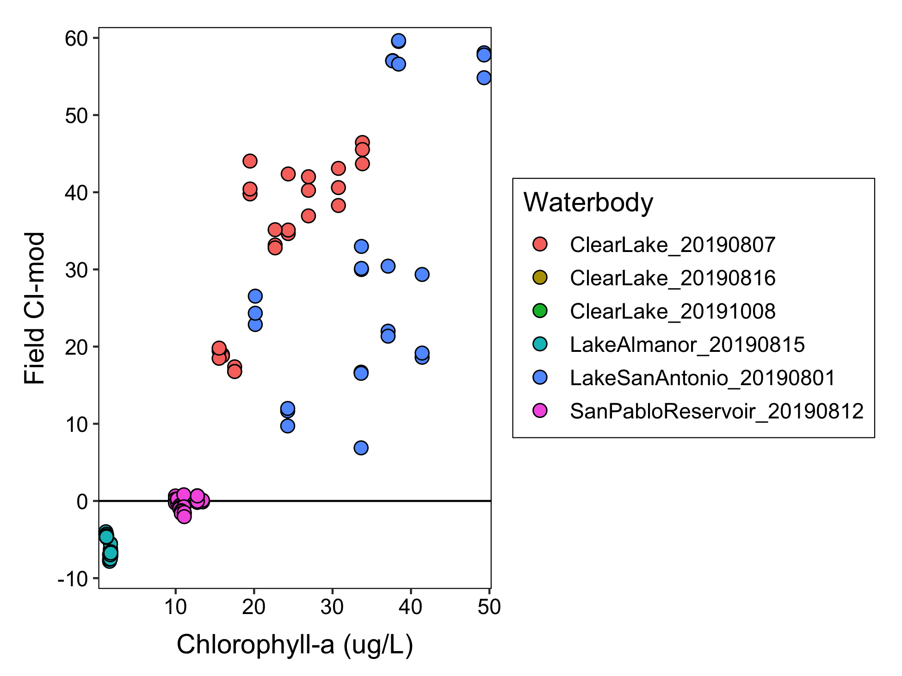
```

   **Figure 9.** Comparison of field CI~mod~ and chlorophyll-a. Colors show the waterbody and sampling date.

There was no strong relationship between SS(665) and CI~mod~ (Fig. 10). Surprisingly, Lake Almanor, which had the lowest chl-a concentrations had SS(665) values comparable to Clear Lake, which had visible cyanobacterial colonies. 

```{r, echo=FALSE, fig.cap="", out.width = '60%', fig.align= "center"}
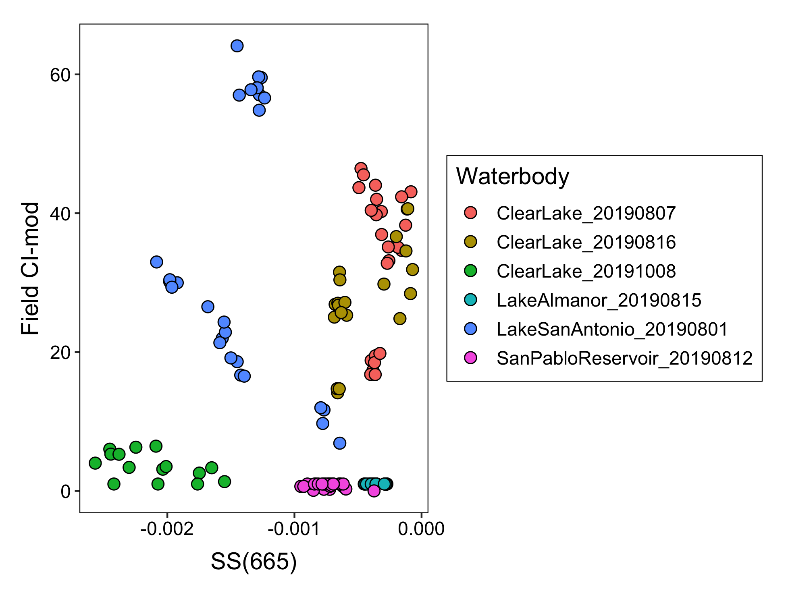
```
   
   **Figure 10.** Relationship between SS(665) and field CI~mod~ for all waterbodies.
   
## **Discussion**  
  
* Are the CI value equations and interpretations correct?  

* Are the SS(665) values <0 expected or reasonable? Is this surprising?

* The CI~mod~ values from the field were all <60, which on a scale of 1-1000 are relatively low. Do these results suggest that there is a lot of noise in the satellite data at low CI-od values, where the satellite is more prone to generate false negative pixels when CI~mod~ <60.  

* SFEI obtains CI~cyano~ from NOAA. It would be nice to see the corresponding CI and CI~cyano~ values for each waterbody to make more comparisons between the field and satellite data. Though SFEI also gets CI and CInoncyano, they exclude it from their data processing workflow, and so there is more data processing work required to obtain these values. 

## References  
  
Lunetta, R, et al. 2015. Evaluation of cyanobacteria cell count detection derived from MERIS imagery across the eastern USA. *Remote Sensing of the Environment* 157:24-34 

Matthews, M, et al. 2012. An algorithm for detecting trophic status (chlorophyll-a), cyanobacterial-dominance, surface scums and floating vegetation in inland and coastal waters. *Remote Sensing of Environment* 124:637-652

Mobley, C. 1999. Estimation of the remote-sensing reflectance from above-surface measurements. *Applied Optics* 38(36):7442-7455.

Tomlinson, S, et al. 2016. Relating chlorophyll from cyanobacteria-dominated inland waters to a MERIS bloom index. *Remote Sensing Letters* 7(2):141-149  
  
Wynne, T, et al. 2008. Relating spectral shape to cyanobacterial blooms in the Laurentian Great Lakes. *International Journal of Remote Sensing* 29(12):3665-3672

Wynne, T, et al. 2018. Harmful Algal Bloom Forecasting Branch Ocean Color Satellite Imagery Processing Guidelines. *NOAA Technical Memorandum* NOS NCCOS 252. doi:10.25923/twc0-f025

