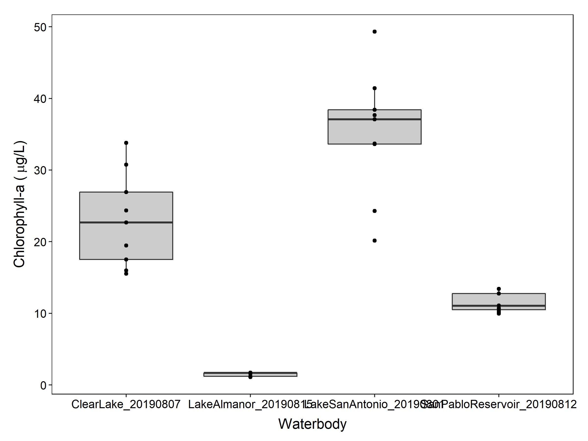
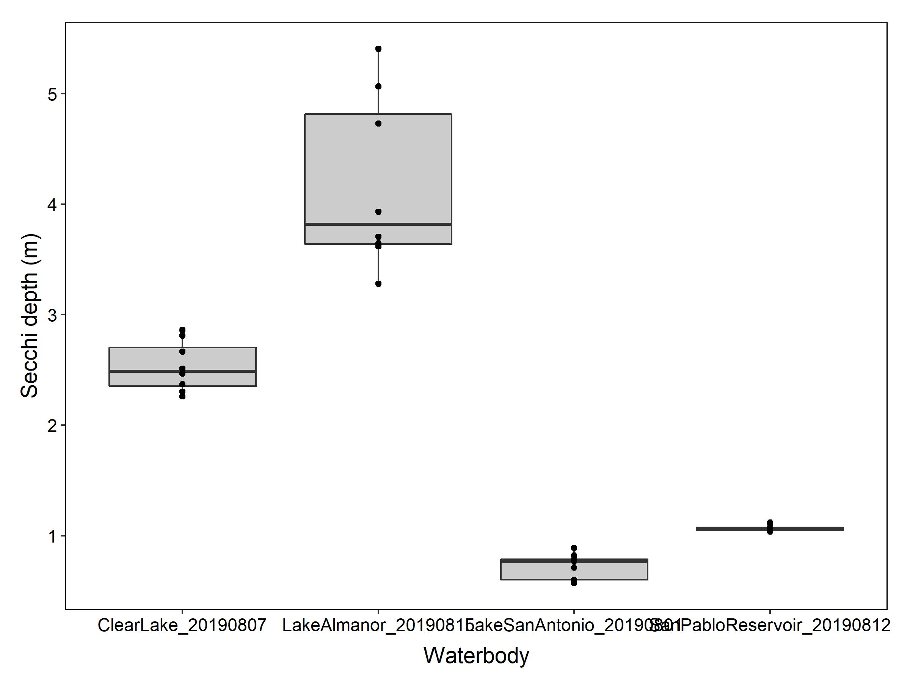
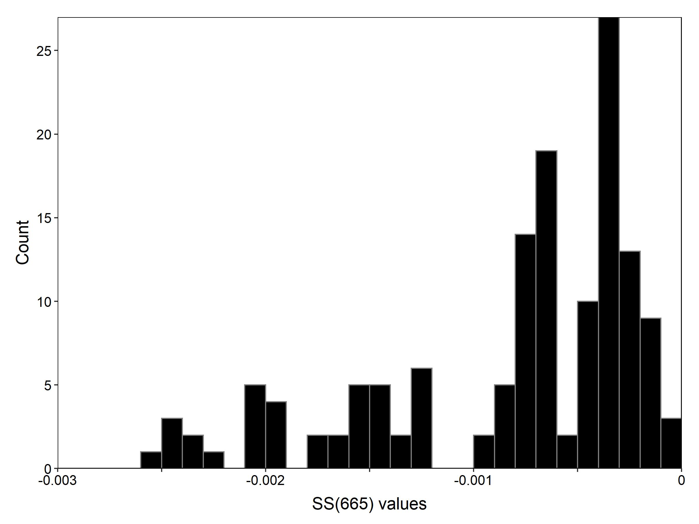
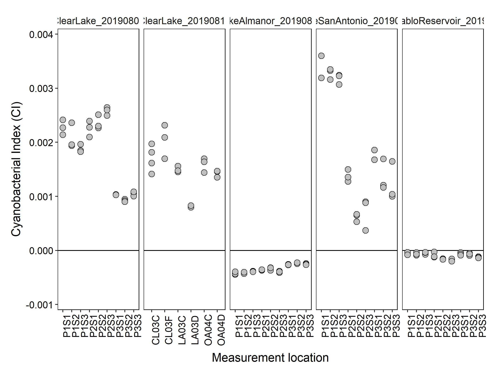
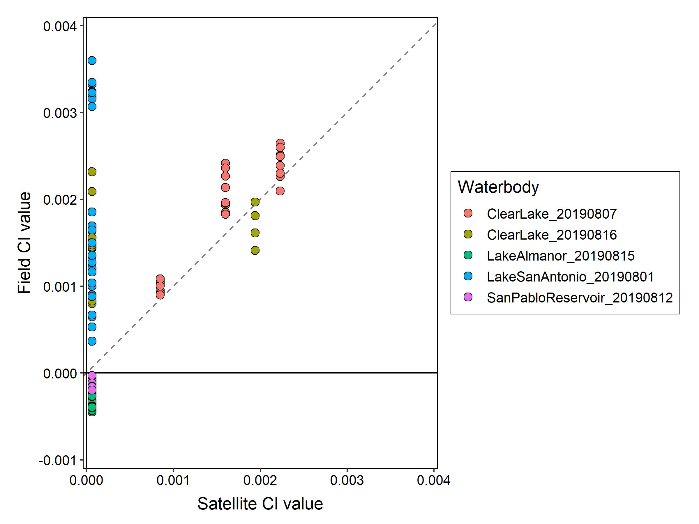
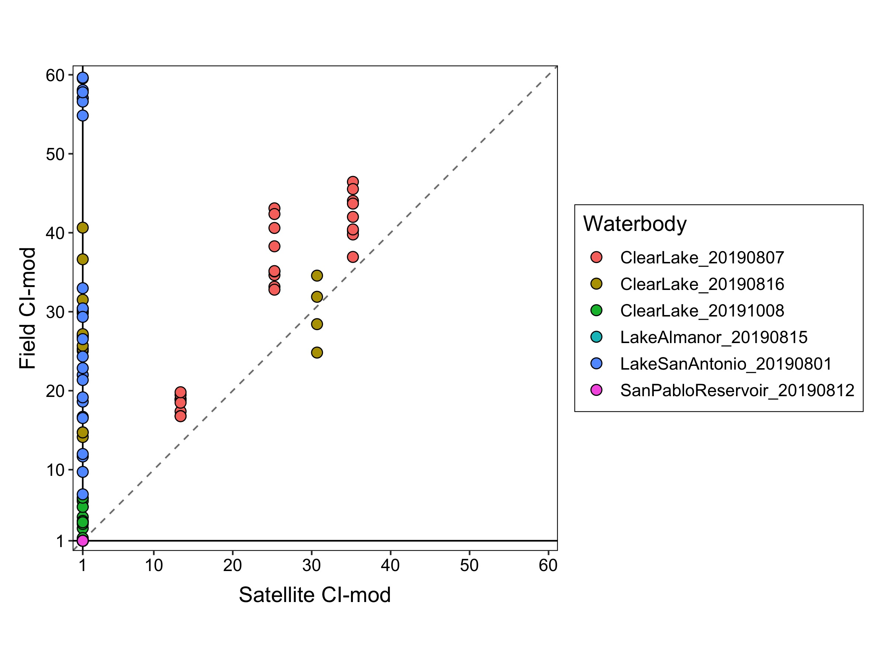
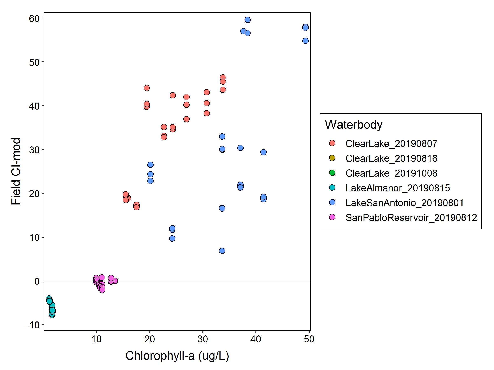
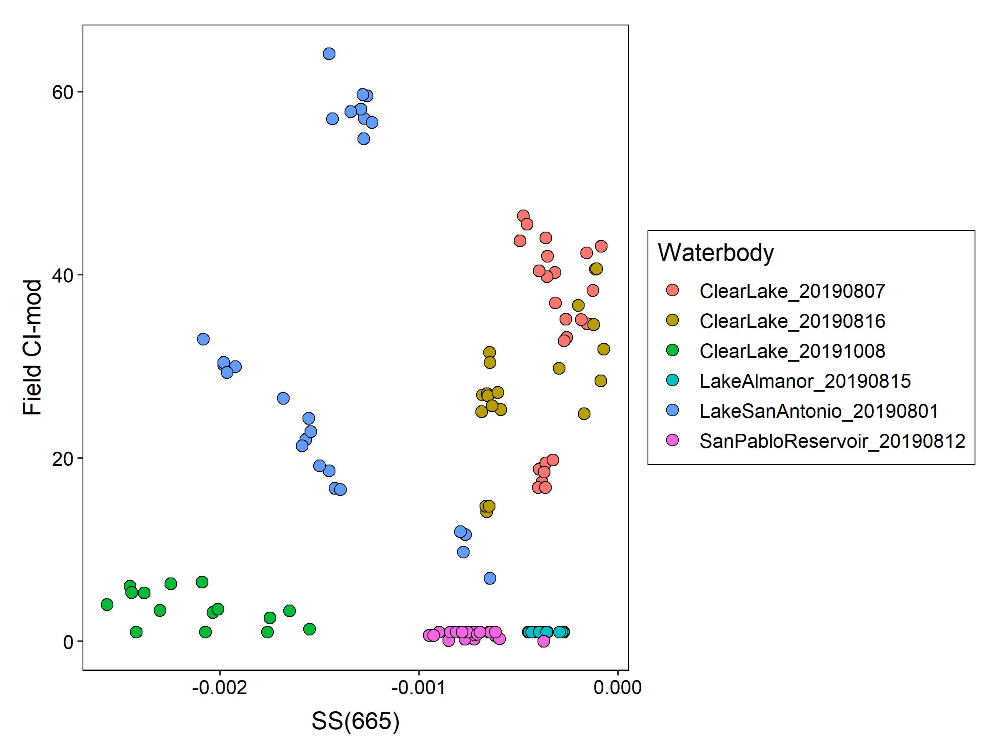

```{r setup, include=FALSE}
knitr::opts_chunk$set(echo = TRUE, message= FALSE)
library(knitr)
library(tidyverse)
```

## **Introduction**

The CA State Waterboards contracted with the San Francisco Estuar Institute (SFEI) to apply satellite imagery to the estimation of cyanobacterial abundance. Algorithms to estimate cyanobacterial abundance in the surface waters of Lake Erie have been developed by Wynne et al. (2008) and Lunetta et al. (2015). Working with NOAA staff, SFEI applied these algorithms to waterbodies in California. 

To better understand the performance of the satellite tool, field verification sampling was conducted in 2019. This document presents the initial results from the 2019 field verification effort.

## **Methods**

#### *Field sampling*

Seven sampling events occurred at four different waterbodies from August 1 to October 8, 2019 (Table 1). Only Clear Lake had satellite pixels with positive CI-final values on the sampling days. There had been blooms at San Pablo Reservoir and Lake San Antonio, but they had dissipated to non-detects on the satellite by the time we were able to sample them. Lake Almanor was chosen due to its higher elevation and previous questionable CI-final values generated by Meris imagery. 

```{R echo= FALSE, results= 'asis'}
lakes <- data.frame(Name= c("Clear Lake", "Lake Almanor", "Lake San Antonio", "San Pablo Reservoir"),
                    County= c("Lake", "Plumas", "Monterrey", "Contra Costa"),
                    `Sampling date`= c("Aug-7, Aug-16, Oct-8", "Aug-15", "Aug-1", "Aug-12"),
                    Size_km2= c("180", "113","23", "60"),
                    elevation_m= c("432", "1373","245", "96")
                    )

kable(lakes, caption= "Table 1. Waterbody information")
```


Field sampling occurred on the same day as the Sentinel-3B flyover. In a waterbody three pixels were selected for sampling. Within a pixel, three samples were collected, for a total of nine measurement sites (Fig. 1). At each sampling point, a Malvern Panalytical Fielspec Handheld2 Pro radiometer was used to collect radiance data. Each reading involved collecting ten measurements at 1 nm wavelength resolution from 300-900 nms, which were then averaged into a single value per nm for the reading. Readings were taken on a calibrated 10% Spectralon reflectance plate, the water, and the sky. All readings were taken 40-45 degrees altitude and 115-130 degrees alzimuth from the sun. Triplicate plate, water, and sky readings were collected at each sampling site. The raw radiance values from the radiometer were converted to remote sensed reflectance (rrs) values per nm using the program `test_asd_group.exe` provided to the Waterboards by NOAA staff.


```{r, echo= FALSE, out.width= "30%"}
include_graphics("../Data/20190801_LakeSanAntonio/lsa_lake_map.jpg")
include_graphics("../Data/20190801_LakeSanAntonio/lsa_lake_bbox_map.jpg")

```
  
  **Figure 1.** Sampling maps of Lake San Antonio. Left panel) Entire lake showing the pixel locations for satellite imagery. Colors show the locations of the sampling pixels. Right panel) Zoom in of the sampling area showing the three different sampling sites within each of the three pixels. Numbers are the pixel ID for the satellite.


#### *Cyanobacterial index calculations*

The rrs values were  used to calculate the cyanobacterial indices CI, CI-cyano, and CI-final. The CI value is derived from the spectral shape (SS) at 681 nm and is calculated with equation 1 in Wynne et al. 2008: $$SS(681) = rrs681 - rrs665 - (rrs709 - rrs665) * \frac{681-665}{709-665}]$$
More negative SS(681) values represent higher cyanobacterial abundances in the surface waters of a pixel. To transform into a more intuitive value the SS(681) is converted to CI by: $$CI = -1*SS(681)$$ CI values <0 indicate no cyanobacteria present. However, certain water conditions can generate positive CI values, even when there are no cyanobacteria present. To reduce the frequency of false positives, Lunetta et al. 2015 proposed an additional indice, CI-cyano, based on the spectral shape at 665 nm, which is calculated by: $$CIcyano = rrs665 - rrs620 + (rrs620 - rrs681) * \frac{665-620}{681-620}$$

When CI-cyano is >0 it indicates cyanobacteria present in the water and when it is <0, cyanobacteria is predicted to be absent. CI-cyano is then transformed into a binary value of 0 when CI-cyano <0 and 1 when CIcyano >0. Then for a given pixel the final CI value is calculated by: $$CIfinal = CIcyano * CI$$

This will render all measurements with CIcyano = 0 as non-detects, even if they had a positive CI value.

#### *Satellite data calculations*
Satellite data is provided from NOAA and given as an integer for each pixel ranging in values 0-250, corresponding to increasing CI-final value. The pixel integer is converted to CI-final with: $$CIfinal = 10^{0.012 * PixInteger - 4.2} $$

SFEI and the CA Waterboards then multiply CI-final by a constant to make the values easier to work with by putting them on a scale of 1-1000. This index is called CI-mod and calculateted by: $$CImod = CIfinal * 15805.18$$


## **Results**

#### *Lake conditions*
Lakes ranged in phytoplankton concentrations, with median chl-a concentrations ranging from 1-40 ug/L (Fig. 1) and Secchi depths ranged from <1 - 4.5 meters (Fig. 2). Only in Clear Lake were cyanobacterial colonies visible (Fig. 4), however, microscopic analysis of samples did identify cyanobacterial taxa in some waterbodies, including *Dolichospermum*, *Microcystis*, and *Gloeotrichia* (Table 2). No cell counts of cyanobacteria abundance were performed.

```{r, echo=FALSE, fig.cap="", out.width = '60%', fig.align= "center"}

```
  
**Figure 2.** Chlorophyll-a concentrations at sampling locations in waterbodies. (Note: data is missing for Clear Lake on Aug-16 and Oct-8).  

```{r, echo=FALSE,  fig.cap="", out.width = '60%', fig.align= "center"}

```
  
**Figure 3.** Secchi depth at sampling locations in waterbodies. (Note: data is missing for Clear Lake on Aug-16 and Oct-8).  


```{R echo= FALSE, results= 'asis'}

cyano_taxa <- data.frame(Name= c("Clear Lake", "Clear Lake", "Clear Lake", "Lake Almanor", "Lake San Antonio", "San Pablo Reservoir"),
                    Sampling_date= c("Aug-7", "Aug-16", "Oct-8", "Aug-15", "Aug-1", "Aug-12"),
                    Cyanobacteria= c("Microcystis, Gloeotrichia, Dolichospermum", "No data","No data", "None", "Dolichospermum", "Dolichospermum"))

kable(cyano_taxa, caption= "Table 2. Microscopic cyanobacteria identification.")

```

```{r, echo=FALSE, fig.cap="", out.width = '50%'}

include_graphics("../Data/20190801_LakeSanAntonio/Pictures/IMG_1885.jpg")
include_graphics("../Data/20190815_LakeAlmanor/Pictures/20190815_112655.jpg")

```
  
```{r, echo=FALSE, fig.cap="", out.width = '50%', out.extra= 'angle=270', results= "asis"}

include_graphics("../Data/20190816_ClearLake/Pictures/IMG_5690.png")
include_graphics("../Data/20191008_ClearLake/Pictures/pic4.jpg")

```
    
  
**Figure 4.** Photographs of water conditions on sampling days. Top row (left to right): Lake San Antonio, Lake Almanon. Botom row (left to right) Clear Lake (16-Aug), Clear Lake (08-Oct).  

#### *Remote sensed reflectance spectra*
  
The field collected remote sensed reflectance (rrs) showed chlorophyll-a reflectance peaks (~700 nm) in samples with high chlorophyll-a concentrations, Clear Lake and Lake San Antonio (Fig. 5 top row). Lake Alanor had the lowest chl-a concentratios (Fig. 4) and there was no reflectance peak at 700 nm, while the peak was smaller in San Pablo Reservoir. The Lake San Antonio and Clear Lake spectra generated some of the highest CI-mod values of 59 and 46 respectively. THe Lake Almanor and San Pablo Reservoir CI-mod values were below satellite detection levels. 
  
```{r, echo=FALSE, fig.cap="", out.width = '50%', results= "asis"}

include_graphics("../Data/20190801_LakeSanAntonio/noaa_files/P1S2_3/avg_rrs_per_group_and_all_groups_2019_08_01___11_32_14_000000_UNKNOWN_UNKNOWN_sky_0.028.png")
include_graphics("../Data/20190807_ClearLake/noaa_files/P2S3_1/avg_rrs_per_group_and_all_groups_2019_08_07___13_05_37_000000_UNKNOWN_UNKNOWN_sky_0.028.png")

```


```{r, echo=FALSE, fig.cap="", out.width = '50%', results= "asis"}

include_graphics("../Data/20190815_LakeAlmanor/noaa_files/P2S2_1/avg_rrs_per_group_and_all_groups_2019_08_15___12_28_20_000000_UNKNOWN_UNKNOWN_sky_0.028.png")
include_graphics("../Data/20190812_SanPabloReservoir/noaa_files/P1S3_1/avg_rrs_per_group_and_all_groups_2019_08_12___11_39_07_000000_UNKNOWN_UNKNOWN_sky_0.028.png")

```
    
**Figure 5.** Remote sensed reflectance spectra. Top row (left to right): Lake San Antonio and Clear Lake (07-Aug). Bottom row (left to right): Lake Almanor and San Pablo Reservoir. 

#### *CIcyano values*
  
All 142 field CI-cyano values were <0 suggesing that cyanobacteria were not present at any of the field sampling locations (Fig. 5). The range of SS(665) values was -0.0025 to -0.000071. 

```{r, echo=FALSE, fig.cap=""}

```
  
  **Figure 5.** Histogram of all SS(665) values (N = 142).
  
  
#### *CI values*  
  
CI values will be shown in the results, since CI-final values would all be zero, because  CI-cyano values were all <0. Variance among the triplicate measurements within a sample was low (Fig. 6). Lake Almanor and San Pablo reservoir had CI values <0 suggesting no cyanobacteria present in the waterbody. All other waterbodies had positive CI values, suggesting the presence of cyanobacteria.  

```{r, echo=FALSE, fig.cap="", out.width = '60%', fig.align= "center"}

```
  
**Figure 6.** CI values from all sampling locations.

The field data estimated higher cyanobacterial abundances than the satellite data (Fig. 7). Both the satellite and field data estimated no cyanobacteria at Lake Almanor and San Pablo Reservoir. The field and satellite data were also well correlated in estimating cyanobacterial abundances at Clear Lake on 07-Aug and a single pixel on 16-Aug. However, all field data from Lake San Antonio, Clear Lake 08-Oct, and two pixels at Clear Lake 16-Aug suggested cyanobacterial abundances, while the satellite estimated no cyanobacteria. The field CI values relaed with chlorophyll-a levels (Fig. 8), than with the the satellite CI values.


```{r, echo=FALSE, fig.cap="", out.width = '50%'}




```

   **Figure 7.** Comparison of field and satellite data. Top panel) Field CI values and Satellite CI values. Bottom panel) Field modified CI values and satellite modified CI values (modified scale 1-1000. Colors show the waterbody and sampling date. The 1:1 line is dashed.
   


```{r, echo=FALSE, fig.cap="", out.width = '60%', fig.align= "center"}

```

   **Figure 8.** Comparison of field CI-mod and chlorophyll-a. Colors show the waterbody and sampling date.

There was no strong relationship between SS(665) and CI-mod (Fig. 9). Surprisingly, Lake Almanor, which had the lowest chl-a concentrations had SS(665) values comprable to Clear Lake, which had visible cyanobacterial colonies. 

```{r, echo=FALSE, fig.cap="", out.width = '60%', fig.align= "center"}

```
   
   **Figure 9.** Relationship between SS(665) and field CI-mod fora all waterbodies.
   
## **Discussion**  
  
* Are the CI value equations and interpretations correct?  

* Are the CI-cyano values <0 expected or reasonable? Is this surprising?

* The CI-mod values from the field were all <60, which on a scale of 1-1000 are relatively low. Do these results suggest that there is a lot of noise in the satellite data at low CI-od values, where the satellite is more prone to generate false negative pixels when CI-mod <60.  


