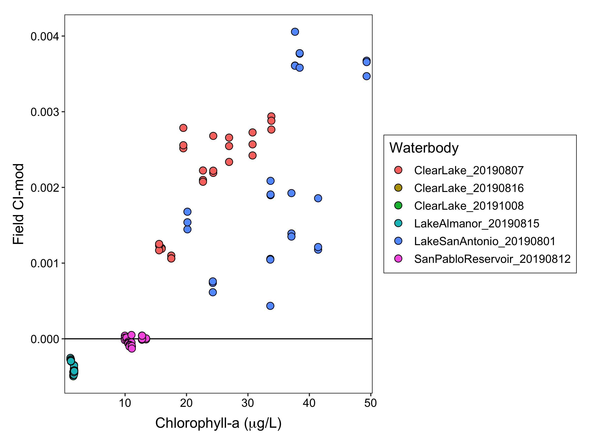

```{r setup, include=FALSE}
knitr::opts_chunk$set(echo = TRUE, message= FALSE)
library(knitr)
library(tidyverse)
```

## **Introduction**

To better understand the performance of the satellite tool field verification sampling was conducted in 2019. The tool was developed by the San Francisco Estuary Institute (SFEI), NOAA, and the California State Water Resources Control Boards, 

This document describes the field verification procedure and presents the initial data. 

## **Methods**

#### *Field sampling*

Field sampling occurred on the same day as the Sentinel-3B flyover. In a waterbody three pixels were selected for sampling. Within a pixel three samples were collected, for a total of nine measurement sites (Fig. 1). At each sampling point, a Malvern Panalytical Fielspec Handheld2 Pro radiometer was used to collect radiance data. Each reading involved collecting ten measurements at 1 nm wavelength resolution from 300-900 nms, which were then averaged into a single value per nm for the reading. Readings were taken on a calibrated 10% Spectralon reflectance plate, the water, and the sky. All readings were taken 40-45 degrees altitude and 115-130 degrees alzimuth from the sun. Triplicate plate, water, and sky readings were collected at eash sampling site. 

Seven sampling events occurred at four different waterbodies from August 1 to October 8, 2019 (Table 1). Only Clear Lake had satellite pixels with positive CItotal values on the sampling days. There had been blooms at San Pablo Reservoir and Lake San Antonio, but they had dissipated to non-detects on the satellite by the time we were able to sample them. Lake Almanor was chosen due to it's higher elevation and previous questionable CItotal values generated by Meris imagery. 

```{r, echo= FALSE, out.width= "30%", fig.align= "center"}
knitr::include_graphics("../Data/20190801_LakeSanAntonio/lsa_lake_map.jpg")
knitr::include_graphics("../Data/20190801_LakeSanAntonio/lsa_lake_bbox_map.jpg")

```
  
  **Figure 1.** Sampling maps of Lake San Antonio. Left panel) Entire lake showing the pixel locations for satellite imagery. Colors show the locations of the sampling pixels. Right panel) Zoom in of the sampling area showing the three different sampling sites within each of the three pixels. Numbers are the pixel ID for the satellite.


```{R echo= FALSE, results= 'asis'}
library(knitr)


lakes <- data.frame(Name= c("Clear Lake", "Lake Almanor", "Lake San Antonio", "San Pablo Reservoir"),
                    County= c("Lake", "Plumas", "Monterrey", "Contra Costa"),
                    `Sampling date`= c("Aug-7, Aug-16, Oct-8", "Aug-15", "Aug-1", "Aug-12"),
                    Size= c("xx", "XX","xx", "xx"),
                    elevation= c("xx", "XX","xx", "xx")
                    )


kable(lakes, caption= "Table 1. Waterbody information")

#xtable::xtable(lakes, caption="Table 1. Waterbody information", type= "html", auto= TRUE)

#stargazer::stargazer(lakes, summary= FALSE, type= "latex", style= "qje")

```

#### *Field radiometer calculations*
The raw radiance values from the radiometer were converted to remote sensed reflectance (rrs) values per nm using the program `test_asd_group.exe` provided to the Waterboards by NOAA staff.

The rrs values were then used to calculate the cyanobacterial indices CI and CIcyano. The CI value is derived from the spectral shape at 665 nm is calculated from equation 1 in Wynne et al. 2008: $$SS(681) = rrs681 - rrs665 - (rrs709 - rrs665) * \frac{681-665}{709-665}]$$
More negative CI values represent higher cyanobacterial abundances in the surface waters of a pixel. To transform into a more intuitive value the SS(681) is converted to CI by: $$CI = -1*SS(681)$$ CI values <0 indicate no cyanobacteria present. However, certain water conditions can generate positive CI values when there are no cyanobacteria present. To reduce the frequency of false positives, Lunetta et al. 2015 proposed an additional indice, CIcyano, based on the spectral shape at 665 nm, which is calculated by: $$CIcyano = rrs665 - rrs620 + (rrs620 - rrs681) * \frac{665-620}{681-620}$$

When CIcyano is >0 it indicates cyanobacteria present in the water and when it is <0, cyanobacteria is predicted to be absent. CIcyano is then transformed into a binary value of 0 when CIcyano <0 and 1 when CIcyano > 0. Then for a given pixel the final CI value is calculated by: $$CIfinal = CIcyano * CI$$

This will render all measurements with CIcyano = 0 as non-detects, even if they had a positiv CI value.

#### *Satellite data calculations*
Satellite data is provided from NOAA and given as an integer for each pixel ranging in values 0-250, corresponding to increasing CIfinal value. The pixel integer is converted to CIfinal with: $$CI_final = 10^{0.012 * PixInteger - 4.2} $$

SFEI and the CA Waterboards then multiply CI_final by a constant to make the values easier to work with by putting them on a scale of 0-1000. This index is called CI_mod and calculateted by: $$CImod = CIfinal * 15805.18$$


## **Results**

#### *Lake conditions*
Lakes ranged in phytoplankton concentrations, with median chl-a concentrations ranging from 1-40 ug/L (Fig. 1) and Secchi depths ranged from <1 - 4.5 meters (Fig. 2). Only in Clear Lake were cyanobacterial colonies visible, however, microscopic analysis of samples did identify cyanobacterial taxa in some waterbodies, including *Dolichospermum*, *Microcystis*, and *Gloeotrichia*.

```{r, echo=FALSE, fig.cap="", out.width = '60%', fig.align= "center"}
# knitr::include_graphics("C://Users/KBouma-Gregson/Documents/Satellite_CI_index/satellite_field_verification_git/Data/Figures_output/chla.jpg")

knitr::include_graphics("../Data/Figures_output/chla.jpg")
```
  
**Figure 2.** Chlorophyll-a concentrations at sampling locations in waterbodies. (Note: data is missing for Clear Lake on Aug-16 and Oct-8).  

```{r, echo=FALSE,  fig.cap="", out.width = '60%', fig.align= "center"}
knitr::include_graphics("../Data/Figures_output/secchi.jpg")
```
  
**Figure 3.** Secchi depth at sampling locations in waterbodies. (Note: data is missing for Clear Lake on Aug-16 and Oct-8).  


```{R echo= FALSE, results= 'asis'}
library(knitr)


cyano_taxa <- data.frame(Name= c("Clear Lake", "Clear Lake", "Clear Lake", "Lake Almanor", "Lake San Antonio", "San Pablo Reservoir"),
                    Sampling_date= c("Aug-7", "Aug-16", "Oct-8", "Aug-15", "Aug-1", "Aug-12"),
                    Cyanobacteria= c("Microcystis, Gloeotrichia, Dolichospermum", "No data","No data", "None", "Dolichospermum", "Dolichospermum"))

kable(cyano_taxa, caption= "Table 2. Microscopic cyanobacteria identification.")

```

#### *CIcyano values*

All 142 field CIcyano values were <0 suggesing that cyanobacteria were not present at any of the field sampling locations (Fig. 4). The range of SS(665) values was -0.0025 to -0.000071. 

```{r, echo=FALSE, fig.cap=""}
knitr::include_graphics("../Data/Figures_output/ss665_hist.jpg")
```
  
  **Figure 4.** Histogram of all SS(665) values (N = 142).
  
  
#### *CI values*
 CIfinal values would all be zero, because all CIcyano values were <0. Therefore, only the CI values will be shown in the results. Variance among the triplicate measurements within a sample was low (Fig. 5). Lake Almanor and San Pablo reservoir had CI values <0 suggesting no cyanobacteria present in the waterbody. All other waterbodies had positive CI values, suggesting the presence of cyanobacteria.  

```{r, echo=FALSE, fig.cap="", out.width = '60%', fig.align= "center"}
# knitr::include_graphics("C://Users/KBouma-Gregson/Documents/Satellite_CI_index/satellite_field_verification_git/Data/Figures_output/chla.jpg")

knitr::include_graphics("../Data/Figures_output/ci_wbd.jpg")
```
  
  **Figure 5.** CI values from all sampling locations.


The field data estimated higher cyanobacterial abundances than the satellite data (Fig. 6). Both the satellite and field data estimated no cyanobacteria at Lake Almanor and San Pablo Reservoir. The field and satellite data were also well correlated in estimatinc cyanobacterial abundances at Clear Lake on 07-Aug and a single pixel on 16-Aug. However, all field data from Lake San Antonio, Clear Lake 08-Oct, and two pixels at Clear Lake 16-Aug suggested cyanobacterial abundances, while the satellite estimated no cyanobacteria. The field CI values correlated relatively better with chlorophyll-a levels (Fig. 7), than with the the satellite CI values. 


```{r, echo=FALSE, fig.cap="", out.width = '60%', fig.align= "center"}
# knitr::include_graphics("C://Users/KBouma-Gregson/Documents/Satellite_CI_index/satellite_field_verification_git/Data/Figures_output/chla.jpg")

knitr::include_graphics("../Data/Figures_output/ci_fs.jpg")
knitr::include_graphics("../Data/Figures_output/ci_mod_fs.jpg")

```

   **Figure 6.** Comparison of field and satellite data. Top panel) Field CI values and Satellite CI values. Bottom panel) Field modified CI values and satellite modified CI values (modified scale 1-1000. Colors show the waterbody and sampling date. The 1:1 line is dashed.
   


```{r, echo=FALSE, fig.cap="", out.width = '60%', fig.align= "center"}
# knitr::include_graphics("C://Users/KBouma-Gregson/Documents/Satellite_CI_index/satellite_field_verification_git/Data/Figures_output/chla.jpg")



```

   **Figure 7.** Comparison of field CI-mod and chlorophyll-a. Colors show the waterbody and sampling date.
   
   
## **Discussion**


